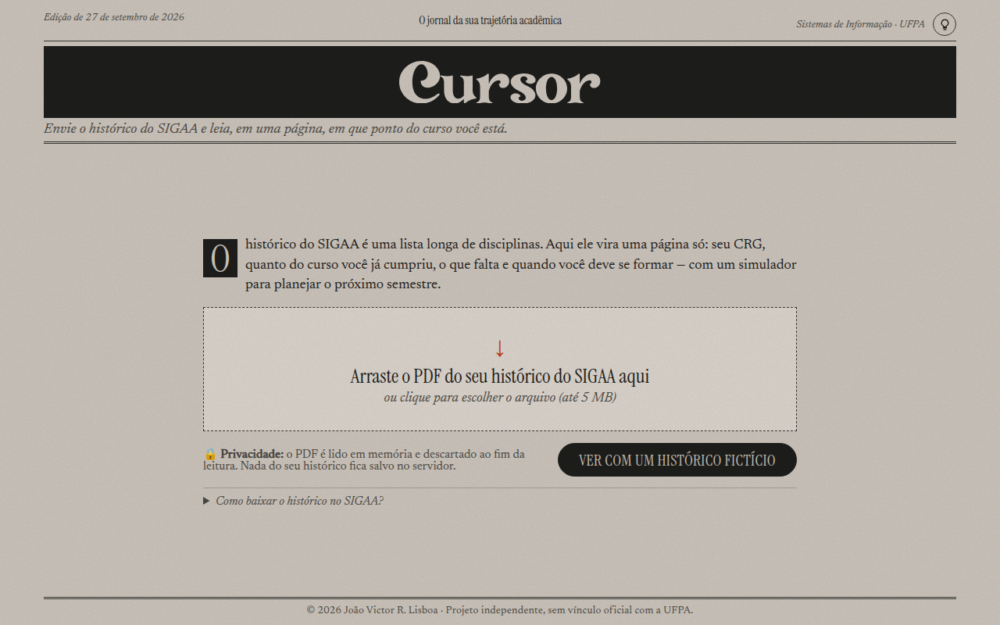

# Cursor

**Calculadora de trajetória acadêmica para alunos da UFPA.** Você envia o PDF do histórico emitido pelo SIGAA e o Cursor mostra, em uma página, em que ponto do curso você está e quanto falta para se formar.

**Acesse:** [cursor-vfrg.onrender.com](https://cursor-vfrg.onrender.com)

> Hospedado no plano gratuito do Render: se o site estiver parado, o primeiro acesso pode levar até um minuto.



**Tecnologias:** Python · FastAPI · pdfplumber · pandas · React · Recharts · Vite · Docker

## O que ele mostra

- **CRG** e **CR de cada semestre**, com gráfico da evolução
- - **Carga horária** cumprida e exigida, com o percentual do curso concluído
- Disciplinas **concluídas** (as mais recentes primeiro) e **não concluídas**
- **Previsão de formatura**, com base no seu ritmo médio de horas por semestre
- **Simulador do próximo semestre:** você escolhe o conceito esperado em cada disciplina e vê como ficam o CRG, o percentual do curso e a previsão. Aceita também disciplinas de fora do currículo (flexibilizadas)

Não tem um histórico em mãos? Clique em **Ver com um histórico fictício**..

## Como funciona

```
Navegador (React)                               Servidor (FastAPI)
─────────────────                               ──────────────────
envia o PDF ────────── POST /api/historico ───▶ parser.py    lê o PDF
                                                metricas.py  calcula CR, horas e previsão
mostra o painel ◀────────────── JSON ──────────
escolhe conceitos ──── POST /api/simulacao ───▶ metricas.py  recalcula com as disciplinas simuladas
mostra antes/depois ◀────────── JSON ──────────
```

**Leitura do PDF (`parser.py`).** No histórico do SIGAA, o nome da disciplina fica numa linha e os dados na linha de baixo:

```
ALGORITMOS
2025.2 COMP001 60 02 100,0 B APROVADO
```

Uma expressão regular reconhece a linha com o código (período, código, CH, conceito e situação), e as linhas em maiúsculas acima dela formam o nome. Também são lidos os valores que o próprio SIGAA imprime: CRG, CR por semestre, tabela de carga horária, prazo e componentes pendentes. O pandas padroniza os nomes, remove repetições e ordena.

**Semestres.** Na UFPA, os períodos .2 e .4 são regulares e o .1 e o .3 são intensivos (férias). Como no SIGAA, `.1 + .2` formam o 1º semestre do ano e `.3 + .4` o 2º.

**Simulador.** A UFPA avalia por conceitos, não por notas. O simulador usa o meio de cada faixa e parte do CRG oficial:

| Conceito | Faixa | Valor usado |
|---|---|---|
| Excelente (E) | 9–10 | 9,5 |
| Bom (B) | 7–8 | 7,5 |
| Regular (R) | 5–6 | 5,5 |
| Insuficiente (I) | 0–4 | 2,0 |

```
CRG novo = (CRG oficial × CH já avaliada + Σ valor do conceito × CH) ÷ (CH já avaliada + Σ CH simulada)
```

Como o PDF mostra só a letra, e não a nota exata, o resultado é uma **estimativa**.

## Privacidade e segurança

- **Nada é guardado.** O PDF é lido na memória e descartado ao fim da requisição. Não há banco de dados. Para simular, o navegador reenvia os dados que já recebeu
- Aceita só PDF de verdade (confere a assinatura `%PDF`), de até 5 MB e 20 páginas
- Tudo o que chega na simulação é validado pelo Pydantic: tipos, tamanhos e conceitos permitidos
- Cabeçalhos de segurança em todas as respostas (`Content-Security-Policy`, `X-Frame-Options`, `X-Content-Type-Options`, `Referrer-Policy`)
- O repositório só tem um histórico **fictício**, e o `.gitignore` bloqueia qualquer outro PDF
- No Docker, o servidor roda com um usuário sem privilégios

## Estrutura

```
Cursor/
├── backend/
│   ├── app/
│   │   ├── main.py        rotas da API, validação e segurança
│   │   ├── parser.py      leitura do PDF
│   │   ├── metricas.py    cálculos e simulador
│   │   └── regras.py      conceitos e fórmula do CR
│   ├── tests/             testes (pytest)
│   └── requirements.txt
├── frontend/
│   ├── src/
│   │   ├── App.jsx        página principal
│   │   ├── api.js         chamadas à API
│   │   ├── formato.js     conceitos e formatação de números
│   │   ├── index.css      visual
│   │   └── components/    uma seção do painel por arquivo
│   └── public/            histórico fictício e ícone
├── Dockerfile             monta o site e a API num único contêiner
├── render.yaml            configuração da hospedagem no Render
└── iniciar.bat            roda o projeto no Windows com um comando
```

## Rodar no computador

**Windows:** dentro da pasta do projeto, rode:

```powershell
.\iniciar.bat
```

O script instala o que faltar (uv, Python 3.12 e as bibliotecas), cria o ambiente virtual `.venv` e abre http://localhost:8000.

**Linux/Mac:**

```bash
python -m venv .venv && source .venv/bin/activate
pip install -r backend/requirements.txt
cd frontend && npm install && npm run build && cd ..
uvicorn app.main:app --app-dir backend --port 8000
```

A documentação da API fica em http://localhost:8000/api/docs.

## Testes

```bash
pip install pytest httpx
cd backend && python -m pytest
```

São 23 testes que cobrem a leitura do PDF, os cálculos e a API, incluindo arquivo inválido, limite de tamanho e cabeçalhos de segurança.

## Hospedagem

O site está no O site está no [Render](https://render.com), no plano gratuito., no plano gratuito. O `Dockerfile` compila o React, instala a API e serve os dois pelo mesmo endereço. Cada `git push` na branch `main` gera um novo deploy.

## Créditos

O logo foi desenhado com a fonte Transcity (Dharmas Studio) e convertido em vetor, então o arquivo da fonte não é distribuído. Os textos usam [Instrument Serif](https://fonts.google.com/specimen/Instrument+Serif) e [Newsreader](https://fonts.google.com/specimen/Newsreader).

Projeto independente, sem vínculo oficial com a UFPA.

---

**João Victor R. Lisboa** · Sistemas de Informação, UFPA · [github.com/joaovictor-rl](https://github.com/joaovictor-rl)
